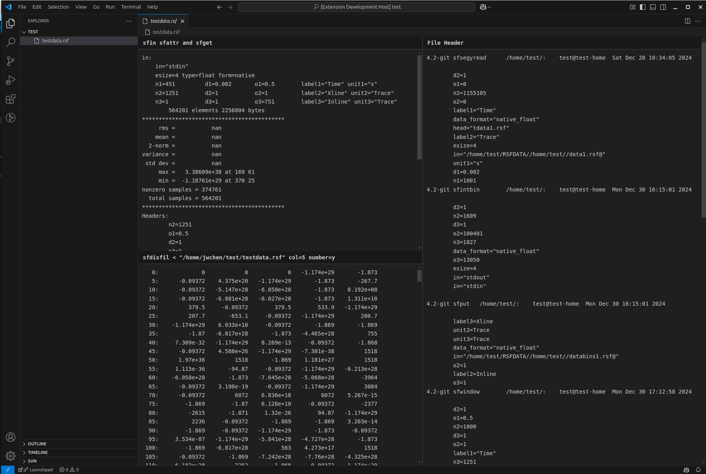

# RSF Reader - A VSCode extension to show Madagascar sesmic data header infos

**You have to install Madagascar (https://ahay.org) first**

## Right click the .rsf file, click "Open With..." and choose "RSF Viewer"

